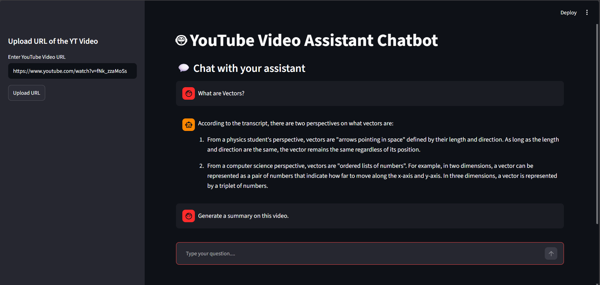

# 📺 YouTube Video Chatbot using Retrieval-Augmented Generation (RAG)

---

## 🧠 Project Overview

This project is an **AI-powered YouTube Video Chatbot** built using **Retrieval-Augmented Generation (RAG)**. It enables users to provide a YouTube video URL, automatically extracts the video's transcript, converts it into semantic embeddings, stores those embeddings in a Pinecone vector database, and answers natural language questions about the video's content.

Instead of relying solely on the knowledge of a Large Language Model (LLM), the chatbot retrieves the most relevant transcript chunks before generating a response, resulting in more accurate and context-aware answers.

---

<p align="center">
  
</p>

---

## 🎓 What is Retrieval-Augmented Generation (RAG)?

Retrieval-Augmented Generation (RAG) combines information retrieval with Large Language Models.

Rather than asking the LLM to answer questions from its pre-trained knowledge, RAG first retrieves the most relevant pieces of information from an external knowledge base. These retrieved documents are then supplied to the LLM as context, enabling grounded and accurate responses while reducing hallucinations.

In this project, the knowledge base consists of transcript chunks extracted from YouTube videos.

---

## 🔄 System Architecture

```text
                YouTube URL
                     │
                     ▼
      YouTube Transcript Extraction
                     │
                     ▼
            Transcript Preprocessing
                     │
                     ▼
              Text Chunk Generation
                     │
                     ▼
     Gemini Embedding Model (Embeddings)
                     │
                     ▼
          Pinecone Vector Database
                     ▲
                     │
User Question ──► Query Embedding
                     │
                     ▼
          Semantic Similarity Search
                     │
                     ▼
      Most Relevant Transcript Chunks
                     │
                     ▼
            Groq Llama 3 LLM
                     │
                     ▼
              Generated Answer
```

---


## ✨ Features

- Upload a YouTube video URL
- Automatically extracts the transcript
- Splits transcripts into semantic chunks
- Generates embeddings using Gemini Embedding (`gemini-embedding-001`)
- Stores embeddings in Pinecone
- Performs semantic similarity search
- Generates context-aware answers using Groq Llama 3
- Streamlit-based interactive user interface
- FastAPI backend for transcript processing and question answering

---

## 🛠️ Tech Stack

| Component | Technology |
|-----------|------------|
| **Frontend** | Streamlit |
| **Backend** | FastAPI |
| **LLM** | Groq (Llama 3) |
| **Embedding Model** | Gemini Embedding (`gemini-embedding-001`) |
| **Vector Database** | Pinecone |
| **Transcript Extraction** | YouTube Transcript API |
| **Deployment** | Streamlit Community Cloud + Render |

---


## ⚙️ Workflow

```text
User enters YouTube URL
        │
        ▼
Transcript Extraction
        │
        ▼
Transcript Chunking
        │
        ▼
Gemini Embeddings
        │
        ▼
Pinecone Vector Store
        │
        ▼
────────────────────────────────────────
User asks a question
        │
        ▼
Query Embedding
        │
        ▼
Similarity Search
        │
        ▼
Relevant Transcript Chunks
        │
        ▼
Groq Llama 3
        │
        ▼
Generated Answer
```

---

## 📚 API Endpoints

### Upload YouTube Video

```http
POST /upload_url/
```

Uploads a YouTube video URL, extracts its transcript, generates embeddings, and stores them in Pinecone.

**Form Field**

```text
url
```

---

### Ask Questions

```http
POST /ask/
```

Asks a question about the indexed YouTube video.

**Form Field**

```text
question
```

---

## 📁 Project Structure

```
└── 📁assets
    └── ui.png
```

```
└── 📁src
    └── 📁Client
          └── 📁components
              ├── ChatUI.py
              ├── download_history.py
              ├── upload.py
          └── 📁utils
              ├── api.py
          ├── app.py
          └── config.py
```

```
    └── 📁server
        └── 📁middlewares
            ├── exception_handlers.py
        └── 📁components
            ├── llm.py
            ├── load_vectorstore.py
            ├── transcript_extraction.py
            ├── query_handler.py
        └── 📁routes
            ├── ask_questions.py
            ├── upload_pdf.py
        └── 📁utils
            ├── common.py
            ├── video_utils.py
        └──📁logger
            ├── __init__.py
        └──📁constants
            ├── __init__.py
            ├── constants.py
        ├── .env
        ├── main.py
        └── requirements.txt
```

```
└── .gitignore
├── LICENSE
├── README.md
└── template.py

```

---

## 🚀 Quick Setup

### Clone the Repository

```bash
git clone https://github.com/Pratikpatil-25/YouTube-Video-Chatbot-using-RAG.git

cd YouTube-Video-Chatbot-using-RAG
```

---

### Backend Setup

```bash
cd src/server

# Create virtual environment
uv venv

# Activate virtual environment

# Windows
.venv\Scripts\activate

# Linux / macOS
source .venv/bin/activate

# Install dependencies
uv pip install -r requirements.txt
```

Create a `.env` file inside the `server` directory.

```env
GOOGLE_API_KEY=YOUR_GOOGLE_API_KEY
GROQ_API_KEY=YOUR_GROQ_API_KEY
PINECONE_API_KEY=YOUR_PINECONE_API_KEY
PINECONE_INDEX_NAME=YOUR_INDEX_NAME
```

Run the FastAPI server.

```bash
uvicorn main:app --reload --port 8000
```

---

### Frontend Setup

```bash
cd src/client

# Run Streamlit
streamlit run app.py
```

---

## 🌐 Deployment

### Backend (Render)

Deploy the FastAPI backend on **Render**.

Use the following start command.

```bash
uvicorn main:app --host 0.0.0.0 --port $PORT
```

---

### Frontend (Streamlit Community Cloud)

Deploy the Streamlit frontend on **Streamlit Community Cloud**.

Update the backend API URL inside:

```text
src/client/config.py
```

so that it points to your deployed Render backend.

---

## 🚧 Current Limitation

Transcript extraction relies on the **YouTube Transcript API**. Some cloud providers (including Render) may experience transcript retrieval failures because YouTube blocks anonymous requests originating from certain cloud IP ranges.

For local development, transcript extraction works as expected. Once transcript embeddings are stored in Pinecone, the deployed chatbot can answer questions using the indexed content.

---

## 🌟 Future Improvements

- Support multiple indexed YouTube videos
- Metadata filtering by video ID
- Persistent chat history
- Multiple LLM support
- Automatic transcript language detection
- Hybrid Search (Dense + Sparse Retrieval)

---

## 👨‍💻 Author

**Pratik Patil**

---

## 📄 License

This project is licensed under the MIT License.
